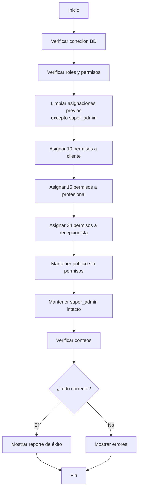

# Script de Asignación de Permisos a Roles

## Descripción

Script automatizado para asignar permisos específicos a cada rol de la clínica según la lógica de negocio definida.

## Características

- ✅ **Idempotente**: Se puede ejecutar múltiples veces sin duplicar permisos
- ✅ **SQL Directo**: Usa queries INSERT IGNORE en lugar de seeders
- ✅ **Verificación**: Valida que los permisos se asignaron correctamente
- ✅ **Reporte Detallado**: Muestra resumen completo con conteo de permisos por rol
- ✅ **Manejo de Errores**: Verifica conexión y existencia de roles/permisos

## Requisitos Previos

Antes de ejecutar el script, asegúrate de:

1. **Docker esté ejecutándose** con los contenedores activos
2. **Migraciones ejecutadas**:
   ```bash
   php artisan migrate:fresh --seed
   ```
3. **Permisos generados** con Filament Shield:
   ```bash
   php artisan shield:generate --all
   php artisan permission:cache-reset
   php artisan icons:cache
   php artisan filament:optimize
   ```

## Uso

### Ejecución Simple

```bash
./scripts/assign_permissions_to_roles_docker.sh
```

### Ejecución con Bash Explícito

```bash
bash scripts/assign_permissions_to_roles_docker.sh
```

## Distribución de Permisos

### 📊 Resumen por Rol

| Rol | Permisos | % del Total | Descripción |
|-----|----------|-------------|-------------|
| `publico` | **0** | 0% | Sin acceso al dashboard (no autenticado) |
| `cliente` | **10** | 8.6% | Ver reservas propias, gestionar reseñas |
| `profesional` | **17** | 14.7% | Gestionar bloqueos, ver/actualizar reservas, gestionar tratamientos propios |
| `recepcionista` | **34** | 29.3% | Gestión completa de operaciones diarias |
| `super_admin` | **116** | 100% | Acceso total al sistema |

---

### 👤 Cliente (10 permisos)

**Reservas** - Solo lectura de las propias:
- `ViewAny:Reserva`
- `View:Reserva`

**Reseñas** - CRUD completo de las propias:
- `ViewAny:Resena`
- `View:Resena`
- `Create:Resena`
- `Update:Resena`
- `Delete:Resena`

**Página y Widgets**:
- `View:MiPerfil`
- `View:ClienteStatsWidget`
- `View:ProximasCitasWidget`

---

### 👨‍⚕️ Profesional (17 permisos)

**BloqueHorarios** - CRUD completo (solo propios):
- `ViewAny:BloqueHorario`
- `View:BloqueHorario`
- `Create:BloqueHorario`
- `Update:BloqueHorario`
- `Delete:BloqueHorario`

**Reservas** - Ver y actualizar (añadir notas):
- `ViewAny:Reserva`
- `View:Reserva`
- `Update:Reserva`

**Tratamientos** - Ver, crear y editar (solo los propios):
- `ViewAny:Tratamiento`
- `View:Tratamiento`
- `Create:Tratamiento` *(Policy: solo puede crear tratamientos asignados a sí mismo)*
- `Update:Tratamiento` *(Policy: solo puede editar sus propios tratamientos)*

**Reseñas** - Solo lectura (ver las que le hacen):
- `ViewAny:Resena`
- `View:Resena`

**Página y Widgets**:
- `View:MiPerfil`
- `View:ProfesionalStatsWidget`
- `View:ProximasCitasWidget`

---

### 🧑‍💼 Recepcionista (34 permisos)

**Reservas** - CRUD completo:
- `ViewAny:Reserva`, `View:Reserva`, `Create:Reserva`, `Update:Reserva`, `Delete:Reserva`

**BloqueHorarios** - CRUD completo:
- `ViewAny:BloqueHorario`, `View:BloqueHorario`, `Create:BloqueHorario`, `Update:BloqueHorario`, `Delete:BloqueHorario`

**HorarioClinica** - CRUD completo:
- `ViewAny:HorarioClinica`, `View:HorarioClinica`, `Create:HorarioClinica`, `Update:HorarioClinica`, `Delete:HorarioClinica`

**Usuarios** - CRUD sin eliminar:
- `ViewAny:User`, `View:User`, `Create:User`, `Update:User`

**ContactMessages** - CRUD completo:
- `ViewAny:ContactMessage`, `View:ContactMessage`, `Create:ContactMessage`, `Update:ContactMessage`, `Delete:ContactMessage`

**Solo Lectura** (Habitaciones, Profesionales, Tratamientos):
- `ViewAny:Habitacion`, `View:Habitacion`
- `ViewAny:Profesional`, `View:Profesional`
- `ViewAny:Tratamiento`, `View:Tratamiento`

**Página y Widgets**:
- `View:MiPerfil`
- `View:ProximasCitasWidget`
- `View:TratamientoStatsWidget`
- `View:CancelacionInfoWidget`

---

## Restricciones de Seguridad

Los siguientes permisos son **EXCLUSIVOS** del `super_admin`:

- ❌ `ForceDelete:*` / `ForceDeleteAny:*` - Eliminar permanentemente
- ❌ `Restore:*` / `RestoreAny:*` - Restaurar registros eliminados
- ❌ `Replicate:*` - Duplicar registros
- ❌ `Reorder:*` - Reordenar registros
- ❌ Todos los permisos sobre `Role` - Gestión de roles

## Flujo de Ejecución



## Ejemplo de Salida

```
╔════════════════════════════════════════════════════════════════╗
║  Script de Asignación de Permisos a Roles - FisioClinic      ║
╚════════════════════════════════════════════════════════════════╝

[1/6] Verificando conexión a la base de datos...
✓ Conexión exitosa a la base de datos 'clinica'

[2/6] Verificando roles y permisos en la base de datos...
✓ Roles encontrados: 5
✓ Permisos encontrados: 116

[3/6] Limpiando asignaciones previas (excepto super_admin)...
✓ Asignaciones anteriores eliminadas

[4/6] Asignando permisos a roles...

  → Asignando permisos a rol 'cliente' (10 permisos)
    ✓ Cliente: 10 permisos asignados

  → Asignando permisos a rol 'profesional' (17 permisos)
    ✓ Profesional: 17 permisos asignados

  → Asignando permisos a rol 'recepcionista' (34 permisos)
    ✓ Recepcionista: 34 permisos asignados

  → Rol 'publico' sin permisos (acceso no autenticado)
    ✓ Publico: 0 permisos (por diseño)

  → Rol 'super_admin' mantiene todos los permisos
    ✓ Super Admin: 116 permisos (sin cambios)

[5/6] Verificando permisos asignados...

Verificación de Permisos:
━━━━━━━━━━━━━━━━━━━━━━━━━━━━━━━━━━
  ✓ cliente:        10 permisos (esperado: 10)
  ✓ profesional:    17 permisos (esperado: 17)
  ✓ recepcionista:  34 permisos (esperado: 34)
  ✓ publico:        0 permisos (esperado: 0)
  ✓ super_admin:    116 permisos (todos)
━━━━━━━━━━━━━━━━━━━━━━━━━━━━━━━━━━

[6/6] Generando reporte final...

═══════════════════════════════════════════════════════════════
               REPORTE DE ASIGNACIÓN DE PERMISOS               
═══════════════════════════════════════════════════════════════

Resumen por Rol:
  • cliente:        10 permisos (8.6% del total)
  • profesional:    17 permisos (14.7% del total)
  • recepcionista:  34 permisos (29.3% del total)
  • publico:        0 permisos (sin acceso)
  • super_admin:    116 permisos (100% - control total)

Total de permisos en sistema: 116
Total de roles configurados: 5

✓ ÉXITO: Todos los permisos se asignaron correctamente

Jerarquía de Permisos:
  super_admin (todos) > recepcionista (34) > profesional (17) > cliente (10) > publico (0)

Nota: Los permisos destructivos (ForceDelete, Restore, etc.) son exclusivos del super_admin

═══════════════════════════════════════════════════════════════
```

## Solución de Problemas

### Error: No se pudo conectar a la base de datos

**Solución**:
```bash
# Verificar que Docker esté ejecutándose
docker ps

# Iniciar los contenedores si no están activos
docker-compose up -d
```

### Error: Se esperaban 5 roles, pero solo se encontraron X

**Solución**:
```bash
php artisan migrate:fresh --seed
```

### Error: Se esperaban al menos 100 permisos, pero solo se encontraron X

**Solución**:
```bash
php artisan shield:generate --all
php artisan permission:cache-reset
```

### Permisos no se asignaron correctamente

**Solución**:
```bash
# Limpiar caché de permisos
php artisan permission:cache-reset

# Ejecutar el script nuevamente
./scripts/assign_permissions_to_roles_docker.sh
```

## Integración con Workflow de Desarrollo

### Después de migrate:fresh

```bash
# 1. Ejecutar migraciones y seeders
php artisan migrate:fresh --seed

# 2. Generar permisos de Shield
php artisan shield:generate --all

# 3. Asignar permisos a roles
./scripts/assign_permissions_to_roles_docker.sh

# 4. Crear super admin (si es necesario)
php artisan shield:super-admin --user=1

# 5. Limpiar cachés
php artisan permission:cache-reset
php artisan icons:cache
php artisan filament:optimize
```

## Notas Técnicas

- El script usa `INSERT IGNORE` para ser idempotente
- La tabla `role_has_permissions` tiene una clave compuesta `(permission_id, role_id)`
- El `super_admin` nunca se ve afectado por la limpieza de permisos
- Las Policies de Laravel/Filament se encargan de filtrar los registros por propietario

## Autor

Script creado para FisioClinic - Sistema de Gestión de Clínica

## Versión

v1.0.0 - Enero 2026
