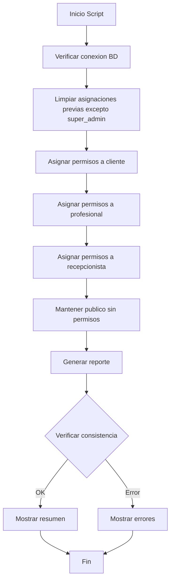

# Plan: Script de Asignación de Permisos a Roles

## Resumen del Proyecto

Crear un script SQL idempotente que asigne permisos a los 5 roles de la clínica de forma lógica y consistente con la lógica de negocio.

## Información Base

### Roles Existentes (5 roles)
| ID | Nombre | Descripción |
|----|--------|-------------|
| 1 | cliente | Usuarios que reservan citas |
| 2 | profesional | Fisioterapeutas que atienden citas |
| 3 | recepcionista | Gestiona reservas y clientes |
| 4 | publico | Sin acceso al dashboard (no autenticado) |
| 5 | super_admin | Acceso completo a todo |

### Recursos Filament (10 Resources)
1. **BloqueHorarioResource** - Gestión de bloqueos de horario
2. **ContactMessageResource** - Mensajes de contacto
3. **HabitacionResource** - Habitaciones/Salas de la clínica
4. **HorarioClinicaResource** - Horarios de apertura/cierre
5. **MisReservasResource** - Reservas del usuario (vista cliente)
6. **ProfesionalResource** - Profesionales/Fisioterapeutas
7. **ResenaResource** - Reseñas de clientes
8. **ReservaResource** - Sistema de reservas
9. **TratamientoResource** - Tratamientos disponibles
10. **UserResource** - Gestión de usuarios

### Páginas Filament (1 página)
- **MiPerfil** - Perfil del usuario

### Widgets Filament (5 widgets)
1. **CancelacionInfoWidget** - Info de cancelaciones
2. **ClienteStatsWidget** - Estadísticas para clientes
3. **ProfesionalStatsWidget** - Estadísticas para profesionales
4. **ProximasCitasWidget** - Próximas citas
5. **TratamientoStatsWidget** - Estadísticas de tratamientos

### Tipos de Permisos por Recurso
- `ViewAny:{Recurso}` - Listar registros
- `View:{Recurso}` - Ver detalle de un registro
- `Create:{Recurso}` - Crear nuevo registro
- `Update:{Recurso}` - Editar registro
- `Delete:{Recurso}` - Eliminar registro
- `Restore:{Recurso}` - Restaurar registro eliminado (soft delete)
- `ForceDelete:{Recurso}` - Eliminar permanentemente
- `ForceDeleteAny:{Recurso}` - Eliminar permanentemente múltiples
- `RestoreAny:{Recurso}` - Restaurar múltiples
- `Replicate:{Recurso}` - Duplicar registro
- `Reorder:{Recurso}` - Reordenar registros

---

## Matriz de Permisos por Rol

### Rol: `publico` (ID: 4)
**Sin permisos** - Los usuarios no autenticados no acceden al dashboard.

---

### Rol: `cliente` (ID: 1)

#### Reservas (MisReservas)
| Permiso | Asignar | Notas |
|---------|---------|-------|
| ViewAny:Reserva | ✅ | Solo ve sus propias reservas (Policy) |
| View:Reserva | ✅ | Solo ve detalle de sus reservas |
| Create:Reserva | ❌ | Crea desde la web pública |
| Update:Reserva | ❌ | No puede editar |
| Delete:Reserva | ❌ | No puede eliminar |

#### Reseñas
| Permiso | Asignar | Notas |
|---------|---------|-------|
| ViewAny:Resena | ✅ | Ver listado de sus reseñas |
| View:Resena | ✅ | Ver detalle |
| Create:Resena | ✅ | Crear reseña propia |
| Update:Resena | ✅ | Editar reseña propia (Policy) |
| Delete:Resena | ✅ | Eliminar reseña propia (Policy) |

#### Página y Widgets
| Permiso | Asignar |
|---------|---------|
| View:MiPerfil | ✅ |
| View:ClienteStatsWidget | ✅ |
| View:ProximasCitasWidget | ✅ |

**Total permisos cliente: 10**

---

### Rol: `profesional` (ID: 2)

#### BloqueHorarios (propios)
| Permiso | Asignar | Notas |
|---------|---------|-------|
| ViewAny:BloqueHorario | ✅ | Solo ve sus bloqueos (Policy) |
| View:BloqueHorario | ✅ | |
| Create:BloqueHorario | ✅ | Crear bloqueos propios |
| Update:BloqueHorario | ✅ | Editar bloqueos propios (Policy) |
| Delete:BloqueHorario | ✅ | Eliminar bloqueos propios (Policy) |

#### Reservas
| Permiso | Asignar | Notas |
|---------|---------|-------|
| ViewAny:Reserva | ✅ | Ve citas asignadas a él |
| View:Reserva | ✅ | Ver detalle |
| Update:Reserva | ✅ | Añadir notas |

#### Tratamientos (solo lectura)
| Permiso | Asignar |
|---------|---------|
| ViewAny:Tratamiento | ✅ |
| View:Tratamiento | ✅ |

#### Reseñas (solo lectura - ver reseñas que le hacen)
| Permiso | Asignar |
|---------|---------|
| ViewAny:Resena | ✅ |
| View:Resena | ✅ |

#### Página y Widgets
| Permiso | Asignar |
|---------|---------|
| View:MiPerfil | ✅ |
| View:ProfesionalStatsWidget | ✅ |
| View:ProximasCitasWidget | ✅ |

**Total permisos profesional: 15**

---

### Rol: `recepcionista` (ID: 3)

#### Reservas (CRUD completo)
| Permiso | Asignar |
|---------|---------|
| ViewAny:Reserva | ✅ |
| View:Reserva | ✅ |
| Create:Reserva | ✅ |
| Update:Reserva | ✅ |
| Delete:Reserva | ✅ |

#### BloqueHorarios (gestión completa)
| Permiso | Asignar |
|---------|---------|
| ViewAny:BloqueHorario | ✅ |
| View:BloqueHorario | ✅ |
| Create:BloqueHorario | ✅ |
| Update:BloqueHorario | ✅ |
| Delete:BloqueHorario | ✅ |

#### HorarioClinica (gestión completa)
| Permiso | Asignar |
|---------|---------|
| ViewAny:HorarioClinica | ✅ |
| View:HorarioClinica | ✅ |
| Create:HorarioClinica | ✅ |
| Update:HorarioClinica | ✅ |
| Delete:HorarioClinica | ✅ |

#### Usuarios (CRUD sin eliminar)
| Permiso | Asignar |
|---------|---------|
| ViewAny:User | ✅ |
| View:User | ✅ |
| Create:User | ✅ |
| Update:User | ✅ |

#### ContactMessages (gestión completa)
| Permiso | Asignar |
|---------|---------|
| ViewAny:ContactMessage | ✅ |
| View:ContactMessage | ✅ |
| Create:ContactMessage | ✅ |
| Update:ContactMessage | ✅ |
| Delete:ContactMessage | ✅ |

#### Solo lectura
| Recurso | Permisos |
|---------|----------|
| Habitacion | ViewAny, View |
| Profesional | ViewAny, View |
| Tratamiento | ViewAny, View |

#### Página y Widgets
| Permiso | Asignar |
|---------|---------|
| View:MiPerfil | ✅ |
| View:ProximasCitasWidget | ✅ |
| View:TratamientoStatsWidget | ✅ |
| View:CancelacionInfoWidget | ✅ |

**Total permisos recepcionista: 34**

---

### Rol: `super_admin` (ID: 5)
**Todos los 116 permisos** - Ya configurado automáticamente por Filament Shield.

---

## Restricciones Importantes

### Permisos EXCLUSIVOS de super_admin
Los siguientes permisos **NUNCA** se asignan a otros roles:
- `ForceDelete:*` - Eliminar permanentemente
- `ForceDeleteAny:*` - Eliminar permanentemente múltiples
- `Restore:*` - Restaurar registros
- `RestoreAny:*` - Restaurar múltiples
- `Replicate:*` - Duplicar registros
- `Reorder:*` - Reordenar registros
- Cualquier permiso sobre `Role` - Gestión de roles

---

## Diagrama de Flujo del Script



---

## Arquitectura del Script

### Ubicación
`scripts/assign_permissions_to_roles.sh`

### Características
1. **Idempotente**: Puede ejecutarse múltiples veces sin duplicar permisos
2. **Transaccional**: Usa transacciones SQL para rollback en caso de error
3. **Verificación**: Valida que los roles y permisos existan antes de asignar
4. **Reporte**: Genera un resumen detallado al finalizar

### Ejecución
```bash
# Desde la raíz del proyecto
./scripts/assign_permissions_to_roles.sh

# O alternativamente
bash scripts/assign_permissions_to_roles.sh
```

---

## Tareas de Implementación

1. ✅ Analizar estructura de tablas de permisos
2. ✅ Listar todos los permisos existentes (116 permisos)
3. ✅ Documentar roles y sus funciones
4. ⬜ Definir matriz de permisos por rol (este documento)
5. ⬜ Crear script bash con queries SQL
6. ⬜ Implementar lógica de asignación para cliente
7. ⬜ Implementar lógica de asignación para profesional
8. ⬜ Implementar lógica de asignación para recepcionista
9. ⬜ Añadir verificación y reporte final
10. ⬜ Probar script con migrate:fresh --seed

---

## Resumen de Permisos por Rol

| Rol | Permisos | % del Total |
|-----|----------|-------------|
| publico | 0 | 0% |
| cliente | 10 | 8.6% |
| profesional | 15 | 12.9% |
| recepcionista | 34 | 29.3% |
| super_admin | 116 | 100% |

---

## Notas Técnicas

### Tabla `role_has_permissions`
```sql
-- Estructura
permission_id BIGINT UNSIGNED (PK, FK)
role_id BIGINT UNSIGNED (PK, FK)
```

### Query de limpieza (idempotente)
```sql
-- Eliminar asignaciones previas excepto super_admin
DELETE FROM role_has_permissions 
WHERE role_id IN (
    SELECT id FROM roles WHERE name != 'super_admin'
);
```

### Query de asignación
```sql
-- Ejemplo: Asignar permiso a rol
INSERT IGNORE INTO role_has_permissions (permission_id, role_id)
SELECT p.id, r.id
FROM permissions p, roles r
WHERE p.name = 'ViewAny:Reserva'
AND r.name = 'cliente';
```
